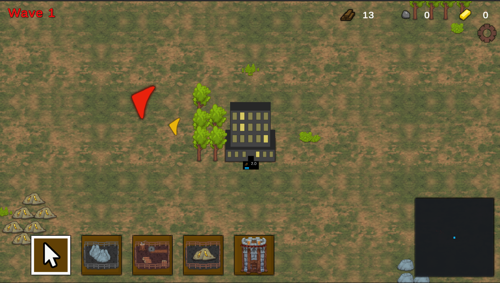
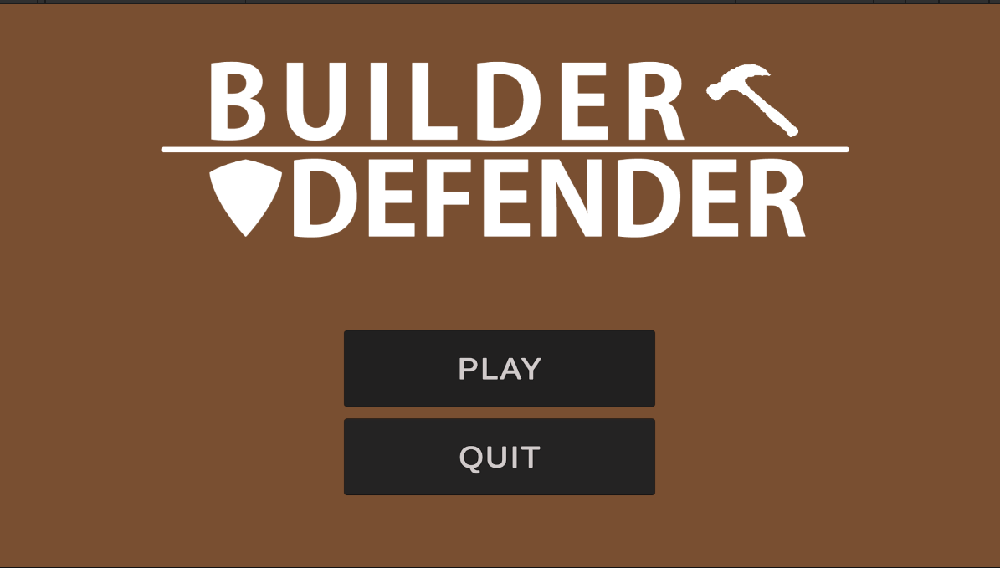

# Builder Defender

Welcome to the Builder Defender  repository! In this game, players embark on a journey to construct and manage their own medieval stronghold, gathering resources, defending against enemy attacks, and expanding their territory.

## Description

Builder Defender  is a strategy game that puts players in the role of a medieval lord tasked with building and defending a thriving settlement. Players must gather resources such as wood, stone, and gold to construct buildings, train troops, and fortify their defenses. As the lord of the realm, you must make strategic decisions to ensure the prosperity and security of your kingdom.

## Features

- **Resource Gathering:** Collect wood, stone, and gold to fuel your kingdom's growth and development.
- **Base Construction:** Build a variety of structures, including houses, barracks, workshops, and defensive walls, to expand your settlement.
- **Troop Training:** Recruit and train medieval soldiers, archers, and knights to defend your base and conquer enemy territories.
- **Enemy Attacks:** Prepare for enemy raids and assaults as rival lords and barbarian hordes seek to plunder your riches and overthrow your rule.
- **Technology Research:** Unlock new technologies and upgrades to enhance your economy, military strength, and defensive capabilities.
- **Quests and Challenges:** Embark on quests, complete challenges, and engage in diplomacy to forge alliances and strengthen your kingdom.
- **Dynamic World:** Experience a dynamic and evolving game world where weather, seasons, and random events influence gameplay and strategy.

## Observer System

Builder Defender implements an Observer system to handle various events and interactions within the game world. This pattern allows different game entities, such as buildings, units, and resources, to observe and react to changes in their environment. For example, when an enemy attack occurs, the Observer system notifies all relevant entities to take appropriate actions, such as defending the base or rallying troops.

## Dependency Injection

Builder Defender utilizes Dependency Injection to manage the dependencies between different game components. This approach promotes modularity, flexibility, and testability by decoupling classes and providing the ability to replace dependencies at runtime. For instance, when constructing a new building, the game uses Dependency Injection to inject the necessary resources and dependencies, such as construction workers and materials, into the building object, allowing for dynamic construction and customization.

## Screenshots

## PlantUML Diagrams

### Class Diagram

### Sequence Diagram

## Gameplay

In Builder Defender, players start with a small settlement and must gradually expand their territory, gather resources, and fortify their defenses to withstand enemy attacks. As you progress, you'll encounter various challenges and opportunities, including rival lords vying for control of the region, barbarian raids threatening your borders, and quests offering rewards and bonuses.

## Installation

To play Builder Defender, simply download the game files from the repository and run the executable or open the web version in your browser.

## Controls

- **Mouse:** Interact with menus, build structures, and command units.
- **Keyboard:** Use hotkeys for quick access to common actions such as selecting buildings, training troops, and issuing commands.

## Play the Game

You can play the game on [itch.io](https://your-username.itch.io/medieval-base-Builder Defender). Enjoy!

## Gameplay Video

Check out the gameplay video [here](https://www.youtube.com/watch?v=your-video-id).

## Contributing

We welcome contributions from the community! If you'd like to contribute to Builder Defender, please fork this repository, make your changes, and submit a pull request.

## Credits

This game was created by Avinash Yadav. It is licensed under the MIT License. See the LICENSE file for more details.

## Feedback

If you have any feedback, suggestions, or bug reports, please open an issue on GitHub or contact us directly.

Enjoy building your medieval kingdom!

